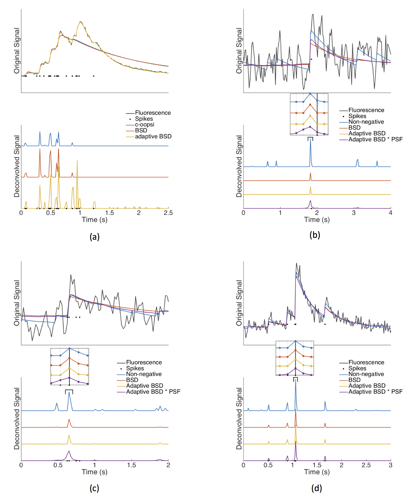

#         BSD



## Blind Spare Deconvolution for inferring spike trains from fluorescence recordings.

The parallel developments of genetically-encoded calcium indicators and fast fluorescence imaging techniques allows one to simultaneously record neural activity of extended neuronal populations in vivo. To fully harness the potential of functional imaging, one needs to infer the sequence of action potentials from fluorescence traces. Here we build on recently proposed computational approaches to develop a blind sparse deconvolution (BSD) algorithm based on a generative model for inferring spike trains from fluorescence traces. BSD features, (1) automatic (fully unsupervised) estimation of the hyperparameters, such as spike amplitude, noise level and rise and decay time constants, (2) a novel analytical estimate of the sparsity prior, which yields enhanced robustness and computational speed with respect to existing methods, (3) automatic thresholding for binarizing spikes that maximizes the precision-recall performance, (4) super-resolution capabilities increasing the temporal resolution beyond the fluorescence signal acquisition rate. BSD also uniquely provides theoretically-grounded estimates of the expected performance of the spike reconstruction in terms of precision-recall and temporal accuracy for each recording. The performance of the algorithm is established using synthetic data and through the SpikeFinder challenge, a community-based initiative for spike-rate inference benchmarking based on a collection of joint electrophysiological and fluorescence recordings. Our method outperforms classical sparse deconvolution algorithms in terms of robustness, speed and/or accuracy and performs competitively in the SpikeFinder challenge.


Author: Jérôme Tubiana (jertubiana@gmail.com)

Current affiliation (2020): Blavatnik School of Computer Science, Tel Aviv University, Israel.

Collaborators: Sébastien Wolf, Thomas Panier, Georges Debregeas.
Copyright: MIT License, 2020

Reference Article: https://www.biorxiv.org/content/10.1101/156364v1


## Installation

Requirements: Matlab with signal processing & optimisation toolboxes.
Installation: Add the folder to Matlab path:

```
addpath(genpath(‘path_to_BSD_folder/BSD’))
```

## Basic usage
Let F be a set of fluorescence traces of size [nNeurons,T].

```
O = struct; O.nNeurons = nNeurons; O.Time = T;
Ninf = BSD(F,O)
```

For all more advanced usages, please refer to the scripts in the examples, figures and SpikeFinder folders.


## Repository content
- main/
  - BSD.m: the main function for inferring spike trains from fluorescence recordings. BSD consists of three stages. (i) First, we infer initial estimates of the generative model parameters (Spike amplitude, noise level, fluorescence kernel, baseline); implemented in BSD_initialization.m (ii) Perform sparse deconvolution to infer spikes from fluorescence trace and generative model parameters; implemented in BSD_deconvolution.m. (iii) Refine the generative model parameters using the fluorescence trace and inferred spike trains; implemented in BSD_parameter_estimation.m. Steps (ii) and (iii) are repeated until convergence.
  - pBSD.m: the parallel version for handling multiple fluorescence recordings.

  - BSD_theoretical_accuracy.m: A function for evaluating the theoretical limits of spike precision-recall and temporal accuracy from the generative model parameters (user-provided or inferred through BSD.m).

  - BSD_convolve_with_PSF.m: A function for convolving the inferred spike trains with the predicted Point-Spread Function (PSF). Convolving with the PSF accounts for the uncertainty on the spike location, and increases the equal-time correlation with the true spike train.

  - examples/ scripts of basic examples.
    - tutorial.m: basic and advanced examples (adding user-provided initial parameters, enforcing parameters,...)
    - superresolution.m: super-resolution example.
    - convolve_with_PSF.m: spike inference followed by convolution with the inferred Point-Spread Function.
    - theoretical_accuracy.m: theoretical limit on accuracy example.


  - SpikeFinder/ Scripts for reproducing all the SpikeFinder experiments and submission.

  - figures/ Scripts for reproducing figures 1-8 of the article.

- utilities/ Additional routines used in the various scripts.


## Citation

Please cite the reference paper if you use BSD for your research.
